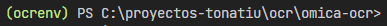
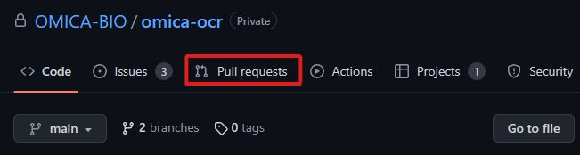
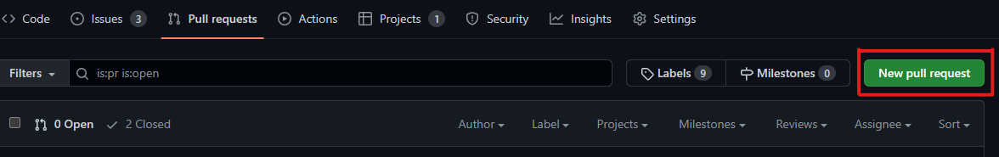
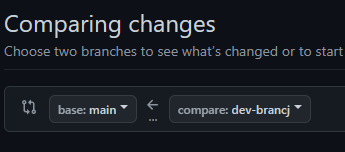

#  AI OCR module

OCR module that's intended to be used as main component of a sysytem to gather data from physical Clinical History documents, some of them filled by hand, and store them in a database for its future use.

# Contents:
- [How to colaborate](#how-to-colaborate)
- [Preprocessing module](#pre-processing)

## How to colaborate

Make sure to have installed Git in your machine.

1. Clone the repository:

2. Create a Virtual Environment - this will help to test locally and create automatically the requirements.txt file

``` bash
python -m venv ocrenv
```
`ocrenv` is the name of the virtual environment and a folder containing the files  for it to work. If changed for some reason, add it to .gitignore file to not consider the file inside that directory for changes in this repository.

To activate the virtual environment if you are running Windows:

```
ocrenv\Scripts\activate.bat
```
To activate the virtual environment if you are running a Linux distro:
``` bash 
source /orcenv/bin/activate
```
It should appear that you're working in the virtual environment as follows:



For any dependency installation inside the virtual env use the following command:
``` bash
python -m pip install [dependency name]
```
3. Create a new branch 

From terminal:

``` bash
git checkout master
git pull
git checkout -b <new_branch_name>
```
Or using VSCode 

`ctrl + shift + p` and write Git: Create branch

4. Once you have made the desired changes, git push(sync) your commits and create a PR(Pull Request) on github






Always compare the branch you worked on to the main branch



Once is reviewed, git merge your branch to the main branch and delete the branch you created.

> Note: Remember to add the usage documentation for everything you develop

## Pre-processing

- Methods:
    - `get_from_file()`: Takes an specified file from path and returns the array of pages read from the file. Right now it works for PDF files only.
    `filepath` parameter is needed. 
    `save` optional parameter is set to False by default, if set to True it will save the images to a temporary directory `tmp/`.

    Example: 
    ``` python
    import os

    path = os.path.abspath('../example.pdf')
    # Create instance of preprocessing module
    preproc = Preprocessing()
    # get array of pages(np array each page)
    pages = preproc.get_from_file(path, True)
    # it will save images to temporary directory as tmp/page_1.png ... 
    ...

    ```
